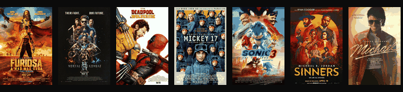

<h1 align="center">Dr Arpit Garg</h1>

<b>Senior ML / Research Engineer · Ph.D.</b>

LLMs · Multimodal AI · Computer Vision · Machine Unlearning · Efficient Training

  
  
  
  
  

  
  
  
  

## About

Senior ML engineer and published researcher working on large language models, multimodal AI, computer vision, machine unlearning, and efficient training systems. I focus on taking research-grade ideas all the way into production at scale.

- **Senior Machine Learning Engineer** at **TikTok** — novel MLLM architectures for Trust & Safety, shipped to production.
- **Research Fellow** at **AIML, University of Adelaide** and **Visiting Research Scientist** at **CSIRO** — lead investigator on an A$2.1M grant training frontier-scale foundation models on 256× NVIDIA H200 GPUs.
- **Co-founder** of **[A2.AI](https://a2ai.com.au)** — an applied-AI venture.
- Previously shipped ML research into VFX pipelines on *Mad Max: Furiosa*, *Mortal Kombat II*, *Deadpool*, *Mickey 17*, *Sonic 3*, *Sinners*, *Michael*, and *A Complete Unknown* at Rising Sun Pictures.

Read the longer story, publications, and interactive explainers at **[arpit2412.github.io](https://arpit2412.github.io)**.

## At a glance

| | | |
|---|---|---|
| 140K+ repo visits | 256× H200 GPUs deployed | A$2.1M grant investigator |
| 10+ peer-reviewed papers | 9 VFX films shipped | 2 patents (US + UK) |

## Selected publications

| Year | Venue | Paper |
|------|-------|-------|
| 2026 | **CVPR** (accepted) | SineProject: Machine Unlearning for Stable Vision-Language Alignment |
| 2026 | NeurIPS (in submission) | LR-LoRA · Mask the Target · Stable Forgetting · STRIDE |
| 2025 | **TPAMI** (under review) | AEON: Adaptive Estimation of Instance-Dependent ID/OOD Label Noise — [arXiv](https://arxiv.org/abs/2501.13389) |
| 2025 | **IMAVIS** | PASS: Peer-Agreement Based Sample Selection for Noisy Labels |
| 2024 | **ECCV** | Instance-Dependent Noisy-Label Learning with Graphical-Model Noise-Rate Estimation |
| 2023 | **WACV** | Instance-Dependent Noisy-Label Learning via Graphical Modelling |
| 2021 | **WACV** | Per-VIS: Person Retrieval in Video Surveillance Using Semantic Description |

Full list on [Google Scholar](https://scholar.google.com.au/citations?user=KOEnJ14AAAAJ&hl=en).

## Patents & honors

- **US Provisional Patent** — Attention mechanism for compute- and memory-efficient LLM training (filed 2026).
- **UK Design Patent (granted, No. 6520933)** — AI-Assisted Rural & Indigenous Healthcare Robot.
- **ICML 2025 Best Reviewer — Gold Award**.
- **Invited Speaker**, MLSS Melbourne 2026.

## Film & VFX

Machine-learning research shipped into production VFX pipelines at **Rising Sun Pictures** — deepfake, gaze-estimation, and generative shot work. Credits on [IMDb](https://www.imdb.com/name/nm16969018/).

<table>
  <tr>
    <td align="center" width="33%"> <b>Furiosa: A Mad Max Saga</b> 2024 · VFX ML Research</td>
    <td align="center" width="33%"> <b>Mortal Kombat II</b> 2025 · VFX ML Research</td>
    <td align="center" width="33%"> <b>Deadpool &amp; Wolverine</b> 2024 · VFX ML Research</td>
  </tr>
  <tr>
    <td align="center" width="33%"> <b>Mickey 17</b> 2025 · VFX ML Research</td>
    <td align="center" width="33%"> <b>Sonic the Hedgehog 3</b> 2024 · VFX ML Research</td>
    <td align="center" width="33%"> <b>Sinners</b> 2025 · VFX ML Research</td>
  </tr>
  <tr>
    <td align="center" width="33%"> <b>Michael</b> 2026 · VFX ML Research</td>
    <td align="center" width="33%"> <b>A Complete Unknown</b> 2024 · VFX ML Research</td>
    <td align="center" width="33%"> <b>La Brea</b> 2023 · VFX ML Research</td>
  </tr>
</table>

## Featured repositories

- [**InstanceGM**](https://github.com/arpit2412/InstanceGM) — Instance-dependent noisy-label learning via graphical modelling (WACV 2023).
- [**PASS-NoisyLabel**](https://github.com/arpit2412/PASS-NoisyLabel) — Peer-agreement based sample selection (IMAVIS 2025).
- [**NoiseRateLearning**](https://github.com/arpit2412/NoiseRateLearning) — Graphical-model-based noise-rate estimation.
- [**Generative-Adversarial-Network**](https://github.com/arpit2412/Generative-Adversarial-Network-) — A tour of major GAN families.
- [**arpit2412.github.io**](https://github.com/arpit2412/arpit2412.github.io) — Portfolio and interactive ML explainers.

## Toolbox

  
  
  
  
  
  
  
  
  
  
  

## GitHub stats

  
  

